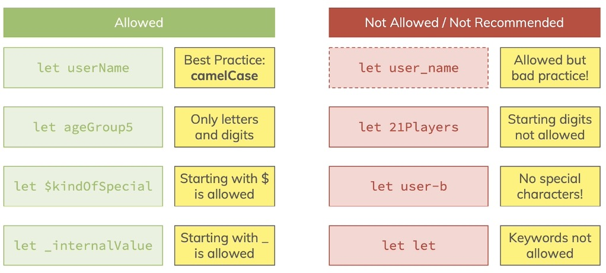

# JavaScript


- [1. Getting Started](#1-getting-started)
- [2. Language Basics, Base Syntax](#2-language-basics-base-syntax)
- [3. Control Structures (if, Loops, Error…)](#3-control-structures-if-loops-error)
- [4. "Behind the Scenes of JS  The (Weird) Past (ES3, ES5) & Present (ES6+)"](#4-behind-the-scenes-of-js--the-weird-past-es3-es5--present-es6)
- [5. A Closer Look at Functions](#5-a-closer-look-at-functions)
- [6. DOM Basics](#6-dom-basics)
- [7. Arrays & Iterables](#7-arrays--iterables)
- [8. Objects](#8-objects)
- [9. Classes & Object-oriented Programming (OOP)](#9-classes--object-oriented-programming-oop)
- [10. Constructor Functions & Prototypes](#10-constructor-functions--prototypes)
- [11. Practice: OOP & Classes](#11-practice-oop--classes)
- [12. More about DOM & Browser APIs](#12-more-about-dom--browser-apis)
- [13. Events](#13-events)
- [14. Advanced Function Concepts](#14-advanced-function-concepts)
- [15. More about Numbers & Strings](#15-more-about-numbers--strings)
- [16. Asynchronous/Async JS: Promises & Callbacks](#16-asynchronousasync-js-promises--callbacks)
- [17. Background Http (Ajax)](#17-background-http-ajax)
- [18. rd Party Libraries](#18-rd-party-libraries)
- [19. JavaScript Modules](#19-javascript-modules)
- [20. Tooling (Webpack, Babel, …)](#20-tooling-webpack-babel-)
- [21. Working with Browser Storage](#21-working-with-browser-storage)
- [22. Browser Support](#22-browser-support)
- [23. Peactice](#23-peactice)
- [24. JavaScript Frameworks](#24-javascript-frameworks)
- [25. Meta-programming: Symbols, Iterators, Generators, Reflect API & Proxy API](#25-meta-programming-symbols-iterators-generators-reflect-api--proxy-api)
- [26. NodeJS Introduction](#26-nodejs-introduction)
- [27. Security](#27-security)
- [28. Deployment](#28-deployment)
- [29. Performance Optimizations & Memory Leaks](#29-performance-optimizations--memory-leaks)
- [30. Testing](#30-testing)
- [31. Bonus: Programming Paradigms (Procedural vs Object Oriented vs Functional)](#31-bonus-programming-paradigms-procedural-vs-object-oriented-vs-functional)
- [32. Bonus: Data Structures & Algorithms Introduction](#32-bonus-data-structures--algorithms-introduction)
- [33. Bonus: TypeScript Introduction](#33-bonus-typescript-introduction)
- [34. Bonus: Web Components](#34-bonus-web-components)
- [35. Roundup & Next Steps](#35-roundup--next-steps)
- [36. Efficient Development & Debugging](#36-efficient-development--debugging)


## 1. Getting Started
### 1.1. Dynamic vs Weakly Typed Languages


## 2. Language Basics, Base Syntax
### 2.1. Variables & Constants


 variable: A data container where the data can be changed during program execution.

### 2.2. Declaring & Defining


### 2.3. Operators


```js
number = number + newNumber; //same as:
number += newNumber

number = number + 1; //same as:
numebr++;
```

### 2.4. Some data types 


**String**  
Javascript template literal `(``)`. [links](https://developer.mozilla.org/en-US/docs/Web/JavaScript/Reference/Template_literals)
```js
let currentResult = "(" + defaultResult + "+ 10) * 3 / 2 -1";
let currentResult = `(${defaultResult} + 10) * 3 / 2 -1`;
```

string Escape notation.[link](https://developer.mozilla.org/en-US/docs/Web/JavaScript/Reference/Global_Objects/String#Escape_notation)  

* css: `white-space: pre`.


### 2.5. Function


A function defines code which doesn't execute right away but which can be executed multiple times by calling the function.  
A function is "code on demand".  
Function parameters are Data that can be provided to the function (input) - available only inside of the function, like local variables.

defines
```js
function functionName(parameter1, parameter2){
  const result = parameter1 + parameter2;
  alert(`The resule is ${result}`)
}
```
call function
```js
functionName()
```

* Build-in function
alert(), addEventListener(), 

* Most importantly: A function is not "an alternative to a variable". It supports a totally different use-case. But it's also worth pointing out that variables are NOT restricted to storing numbers or strings.

### 2.6. "Indirect" vs "Direct" Function Execution

<!-- scope and closures!!!(other section explain more) -->

It can be confusing to see that there seem to be two ways of executing a function:
```js
function add() {
  something = someNum + someOtherNum;
}
```
`add()` vs `add`

It's important to understand why we have these "two ways"!

**In general**, you call a function that you defined by **using its name** (e.g. `add`) and **adding parentheses** (with any parameters the function might need - or empty parentheses if no parameters are required like in the above example).

=> **`add()`**

This is how you execute a function from your code. Whenever JavaScript encounters this statement, it goes ahead and runs the code in the function. Period!

**Sometimes however**, you **don't want to execute the function immediately**. You rather want to "tell JavaScript" that it should execute a certain function **at some point in the future** (e.g. when some event occurs).

That's when you don't directly call the function but when you instead just provide JavaScript with the name of the function.

=> **`someButton.addEventListener('click', add);`**

This snippet would tell JavaScript: "Hey, when the button is clicked, go ahead and execute add.".

**`someButton.addEventListener('click', add());`** would be wrong.

Why? Because JavaScript would encounter that line when it parses/ executes your script and register the event listener AND immediately execute add - because you added parentheses => That means (see above): "Please execute that function!".

Just writing add somewhere in your code would do nothing by the way:
```js
let someVar = 5;
add
alert('Do something else...');
```
Why?

Because you just throw the name of the function in there but **you don't give any other information to JavaScript**. It basically doesn't know what to do with that name ("Should I run that when a click occurs? After a certain amount of time? I don't know...") and hence JavaScript kind of ignores this statement.


### 2.7. return
```js
function functionName(parameter1, parameter2){
  const result = parameter1 + parameter2;
  return result;
}
```
Any code that have write after `return`, won't execute.  


### 2.8. scope and closures

You can't use local/block-scope variables(= declared inside of functions) outside of them.

**shadowing**

What happens if you have this code?
```js
let userName = 'Max';
function greetUser(name) {
  let userName = name;
  alert(userName);
}
userName = 'Manu';
greetUser('Max');
```
This will actually show an alert that says `'Max'` (NOT `'Manu'`).

You might've expected that an error gets thrown because we use and declare userName more than once - and as you learned, that is not allowed.

It indeed is **not allowed on the same level/ in the same scope**.

So this would fail:
```js
let userName = 'Max';
let userName = 'Manu';
```
Why does it work in the first code snippet though?

Because we first create a global variable `userName` via
```js
let userName = 'Max';
```
But then we never re-declare that on the global level (that would not be allowed).

We only declare another variable inside of the function. But since variables in functions get their **own scope**, JavaScript does something which is called **"shadowing"**.

It **creates a new variable on a different scope** - this variables does not overwrite or remove the global variable by the way - **both co-exist**.

When referring to `userName` inside of the `greetUser` function we now **always refer to the local, shadowed variable**. Only **if no such local variable existed, JavaScript would fall back to the global variable**.

### 2.9. Converting Data Types
**change the string to number.**
```js
parseInt(10);
parseFloat(10.1);
```
**also work as**

```js
result + +userInput.value = result + parseInt(userInput.value)
```

**change the number to string.**
```js
result.toString()
```

You saw the example with a number and a "text number" being added

`3 + '3' => '33'`

in JavaScript.

That happens because the + operator also supports strings (for string concatenation).

It's the only arithmetic operator that supports strings though. For example, this will not work:

`'hi' - 'i' => NaN`

`NaN` is covered a little later, the core takeaway is that you can't generate a string of 'h' with the above code. Only + supports both strings and numbers.

Thankfully, JavaScript is pretty smart and therefore is actually able to handle this code:

`3 * '3' => 9`

Please note: It yields the number (!) 9, NOT a string '9'!

Similarly, these operations also all work:

`3 - '3' => 0`

`3 / '3' => 1`

Just `3 + '3'` yields `'33'` because here JavaScript uses the "I can combine text" mode of the + operator and generates a string instead of a number.


### 2.10. arrays
Section 8 will explain more. [link](#8-arrays--iterables)
Array: A list of data of any kind.
```js
newArray = [1, 2, 3]；
newArray.push("4")；
console.log(newArray[0]);
```

### 2.11. object 
Section 9 will explain more. [link](#9-objects)
object: grouped data, structured in key-value pairs.

```js
newObject = {
  name: 'max';
  age: 27;
}；
console.log(newObject.name);
```
### 2.12. undefined, null & NaN


`undefined` & `null` - whilst the two values are similar, they're not equal. undefined is a special type and the default value for undefined variables, null is actually of type object and never a default value of anything.

### 2.13. typeof

`typeof [1, 2, 3]` is an **Object**, or and an **Array**  
`typeof undefined` is **undefined**  
`typeof null` is **Object**  
`typeof NaN` is **number**

### 2.14. import JS file with "defer" & "async"
only for external file


## 3. Control Structures (if, Loops, Error…)
## 4. Behind the Scenes of JS  The (Weird) Past (ES3, ES5) & Present (ES6+)
## 5. A Closer Look at Functions
## 6. DOM Basics
## 7. Arrays & Iterables
## 8. Objects
## 9. Classes & Object-oriented Programming (OOP)
## 10. Constructor Functions & Prototypes
## 11. Practice: OOP & Classes
## 12. More about DOM & Browser APIs
## 13. Events
## 14. Advanced Function Concepts
## 15. More about Numbers & Strings
## 16. Asynchronous/Async JS: Promises & Callbacks
## 17. Background Http (Ajax)
## 18. rd Party Libraries
## 19. JavaScript Modules
## 20. Tooling (Webpack, Babel, …)
## 21. Working with Browser Storage
## 22. Browser Support
## 23. Peactice
## 24. JavaScript Frameworks
## 25. Meta-programming: Symbols, Iterators, Generators, Reflect API & Proxy API
## 26. NodeJS Introduction
## 27. Security
## 28. Deployment
## 29. Performance Optimizations & Memory Leaks
## 30. Testing
## 31. Bonus: Programming Paradigms (Procedural vs Object Oriented vs Functional)
## 32. Bonus: Data Structures & Algorithms Introduction
## 33. Bonus: TypeScript Introduction
## 34. Bonus: Web Components
## 35. Roundup & Next Steps
## 36. Efficient Development & Debugging
### Overview
### IDE
color,theme, Icon, extensions,

### Shortcuts
Toggle bolck comment: `option + shift + a` ;  
Toggle line comment: `cmd + /`;  
Add Selection To Next Find Match: `cmd+d`;  
Add Selection all Match: `cmd + shift + L`;  
