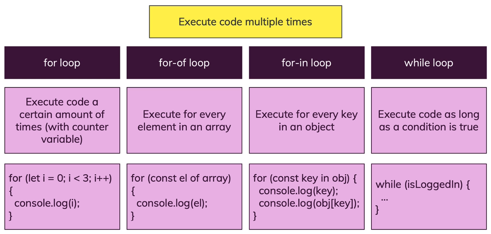

# JavaScript

- [1. Getting Started](#1-getting-started)
- [2. Language Basics, Base Syntax](#2-language-basics-base-syntax)
- [3. Control Structures (if, Loops, Error…)](#3-control-structures-if-loops-error)
- [4. "Behind the Scenes of JS  The (Weird) Past (ES3, ES5) & Present (ES6+)"](#4-behind-the-scenes-of-js--the-weird-past-es3-es5--present-es6)
- [5. A Closer Look at Functions](#5-a-closer-look-at-functions)
- [6. DOM Basics](#6-dom-basics)
- [7. Arrays & Iterables](#7-arrays--iterables)
- [8. Objects](#8-objects)
- [9. Classes & Object-oriented Programming (OOP)](#9-classes--object-oriented-programming-oop)
- [10. Constructor Functions & Prototypes](#10-constructor-functions--prototypes)
- [11. Practice: OOP & Classes](#11-practice-oop--classes)
- [12. More about DOM & Browser APIs](#12-more-about-dom--browser-apis)
- [13. Events](#13-events)
- [14. Advanced Function Concepts](#14-advanced-function-concepts)
- [15. More about Numbers & Strings](#15-more-about-numbers--strings)
- [16. Asynchronous/Async JS: Promises & Callbacks](#16-asynchronousasync-js-promises--callbacks)
- [17. Background Http (Ajax)](#17-background-http-ajax)
- [18. rd Party Libraries](#18-rd-party-libraries)
- [19. JavaScript Modules](#19-javascript-modules)
- [20. Tooling (Webpack, Babel, …)](#20-tooling-webpack-babel-)
- [21. Working with Browser Storage](#21-working-with-browser-storage)
- [22. Browser Support](#22-browser-support)
- [23. Peactice](#23-peactice)
- [24. JavaScript Frameworks](#24-javascript-frameworks)
- [25. Meta-programming: Symbols, Iterators, Generators, Reflect API & Proxy API](#25-meta-programming-symbols-iterators-generators-reflect-api--proxy-api)
- [26. NodeJS Introduction](#26-nodejs-introduction)
- [27. Security](#27-security)
- [28. Deployment](#28-deployment)
- [29. Performance Optimizations & Memory Leaks](#29-performance-optimizations--memory-leaks)
- [30. Testing](#30-testing)
- [31. Bonus: Programming Paradigms (Procedural vs Object Oriented vs Functional)](#31-bonus-programming-paradigms-procedural-vs-object-oriented-vs-functional)
- [32. Bonus: Data Structures & Algorithms Introduction](#32-bonus-data-structures--algorithms-introduction)
- [33. Bonus: TypeScript Introduction](#33-bonus-typescript-introduction)
- [34. Bonus: Web Components](#34-bonus-web-components)
- [35. Roundup & Next Steps](#35-roundup--next-steps)
- [36. Efficient Development & Debugging](#36-efficient-development--debugging)

## 1. Getting Started
### 1.1. Dynamic vs Weakly Typed Languages

## 2. Language Basics, Base Syntax
#
### 2.1. Variables & Constants


variable: A data container where the data can be changed during program execution.

#
### 2.2. Declaring & Defining


**set up as a global value:**
it's also quite common to use all uppercase characters there and separate words with an underscore, to make it really clear that this is a global value which you just hardcoded into the code.
```js
const ATTACK_VALUE = 10;
```


### 2.3. Operators


```js
number = number + newNumber; //same as:
number += newNumber

number = number + 1; //same as:
numebr++;
```
#
### 2.4. Some data types 


**String**  
Javascript template literal `(``)`. [links](https://developer.mozilla.org/en-US/docs/Web/JavaScript/Reference/Template_literals)
```js
let currentResult = "(" + defaultResult + "+ 10) * 3 / 2 -1";
let currentResult = `(${defaultResult} + 10) * 3 / 2 -1`;
```

string Escape notation.[link](https://developer.mozilla.org/en-US/docs/Web/JavaScript/Reference/Global_Objects/String#Escape_notation)  

* css: `white-space: pre`.


#
### 2.5. Function


A function defines code which doesn't execute right away but which can be executed multiple times by calling the function.  

A function is "code on demand".  

Function parameters are Data that can be provided to the function (input) - available only inside of the function, like local variables.

**Most importantly**: A function is not "an alternative to a variable". It supports a totally different use-case. But it's also worth pointing out that variables are NOT restricted to storing numbers or strings.

defines
```js
function functionName(parameter1, parameter2){
  const result = parameter1 + parameter2;
  alert(`The resule is ${result}`)
}
```
call function
```js
functionName()
```

* Build-in function
alert(), addEventListener(), prompt()

  


#
### 2.6. "Indirect" vs "Direct" Function Execution

<!-- scope and closures!!!(other section explain more) -->

It can be confusing to see that there seem to be two ways of executing a function:
```js
function add() {
  something = someNum + someOtherNum;
}
```
`add()` vs `add`

It's important to understand why we have these "two ways"!

**In general**, you call a function that you defined by **using its name** (e.g. `add`) and **adding parentheses** (with any parameters the function might need - or empty parentheses if no parameters are required like in the above example).

=> **`add()`**

This is how you execute a function from your code. Whenever JavaScript encounters this statement, it goes ahead and runs the code in the function. Period!

**Sometimes however**, you **don't want to execute the function immediately**. You rather want to "tell JavaScript" that it should execute a certain function **at some point in the future** (e.g. when some event occurs).

That's when you don't directly call the function but when you instead just provide JavaScript with the name of the function.

=> **`someButton.addEventListener('click', add);`**

This snippet would tell JavaScript: "Hey, when the button is clicked, go ahead and execute add.".

**`someButton.addEventListener('click', add());`** would be wrong.

Why? Because JavaScript would encounter that line when it parses/ executes your script and register the event listener AND immediately execute add - because you added parentheses => That means (see above): "Please execute that function!".

Just writing add somewhere in your code would do nothing by the way:
```js
let someVar = 5;
add
alert('Do something else...');
```
Why?

Because you just throw the name of the function in there but **you don't give any other information to JavaScript**. It basically doesn't know what to do with that name ("Should I run that when a click occurs? After a certain amount of time? I don't know...") and hence JavaScript kind of ignores this statement.


#
### 2.7. return
```js
function functionName(parameter1, parameter2){
  const result = parameter1 + parameter2;
  return result;
}
```
Any code that have write after `return`, won't execute.  


#
### 2.8. scope and closures

You can't use local/block-scope variables(= declared inside of functions) outside of them.

**shadowing**

What happens if you have this code?
```js
let userName = 'Max';
function greetUser(name) {
  let userName = name;
  alert(userName);
}
userName = 'Manu';
greetUser('Max');
```
This will actually show an alert that says `'Max'` (NOT `'Manu'`).

You might've expected that an error gets thrown because we use and declare userName more than once - and as you learned, that is not allowed.

It indeed is **not allowed on the same level/ in the same scope**.

So this would fail:
```js
let userName = 'Max';
let userName = 'Manu';
```
Why does it work in the first code snippet though?

Because we first create a global variable `userName` via
```js
let userName = 'Max';
```
But then we never re-declare that on the global level (that would not be allowed).

We only declare another variable inside of the function. But since variables in functions get their **own scope**, JavaScript does something which is called **"shadowing"**.

It **creates a new variable on a different scope** - this variables does not overwrite or remove the global variable by the way - **both co-exist**.

When referring to `userName` inside of the `greetUser` function we now **always refer to the local, shadowed variable**. Only **if no such local variable existed, JavaScript would fall back to the global variable**.

#
### 2.9. Converting Data Types
**change the string to number.**
```js
parseInt(10);
parseFloat(10.1);
```
**also work as**

```js
result + +userInput.value = result + parseInt(userInput.value)
```

if the number's length is more than 16, it wouldn't work. try use BigInt().

**change the number to string.**
```js
result.toString()
```

**check is it a number.**
```js
isNan(inputNumber)
```


**font setting**

```js
xxx.toUpperCase();
```


You saw the example with a number and a "text number" being added

`3 + '3' => '33'`

in JavaScript.

That happens because the + operator also supports strings (for string concatenation).

It's the only arithmetic operator that supports strings though. For example, this will not work:

`'hi' - 'i' => NaN`

`NaN` is covered a little later, the core takeaway is that you can't generate a string of 'h' with the above code. Only + supports both strings and numbers.

Thankfully, JavaScript is pretty smart and therefore is actually able to handle this code:

`3 * '3' => 9`

Please note: It yields the number (!) 9, NOT a string '9'!

Similarly, these operations also all work:

`3 - '3' => 0`

`3 / '3' => 1`

Just `3 + '3'` yields `'33'` because here JavaScript uses the "I can combine text" mode of the + operator and generates a string instead of a number.


#
### 2.10. arrays
Section 8 will explain more. [link](#8-arrays--iterables)
Array: A list of data of any kind.
```js
newArray = [1, 2, 3]；
newArray.push("4")；
console.log(newArray[0]);
```

#
### 2.11. object 
Section 9 will explain more. [link](#9-objects)
object: grouped data, structured in key-value pairs.

```js
newObject = {
  name: 'max';
  age: 27;
}；
console.log(newObject.name);
```
#
### 2.12. undefined, null & NaN


`undefined` & `null` - whilst the two values are similar, they're not equal. undefined is a special type and the default value for undefined variables, null is actually of type object and never a default value of anything.

#
### 2.13. type of

`typeof [1, 2, 3]` is an **Object**
`typeof undefined` is **undefined**  
`typeof null` is **Object**  
`typeof NaN` is **number**

#
### 2.14. import JS file with "defer" & "async"
only for external file


## 3. Control Structures (if, Loops, Error…)
- conditional Statements(if) & Expressions
- Boolean Values & Operators
- Loops in JavaScript
- Error Handing


#
### 3.1. conditional code


Understanding the "Condition"
Always keep in mind that `condition` in

```js
if (condition) { ... }
```
simply has to be a **boolean value**.

Often, you'll generate such a boolean value with the help of `===`, `>`, `<` etc. **All these operators** yield boolean values (without changing the variables/ values you're using them on).

Since `if` only wants a boolean, you of course **don't have to use such an operator**. If you already got a variable that holds a boolean, you can use it without any extra operator.

Example:
```js
const isLoggedIn = true;
if (isLoggedIn) {
    // This code will execute because isLoggedIn is true => A valid condition
}
```
You could write
```js
const isLoggedIn = true;
if (isLoggedIn === true) {
    ...
}
```
but that would be **redundant**. You'd generate another new boolean where you already got one.

You can use the ! operator to negate ("invert") the value:
```js
const isLoggedIn = true;
if (!isLoggedIn) {
  // This code will NOT execute because isLoggedIn is true but ! inverts it (in this check)
} else {
  // This would execute because !isLoggedIn yields false => else block executes
}
```
Again, that would be similar to:
```js
const isLoggedIn = true;
if (isLoggedIn !== true) {
    // This would NOT execute
} else {
    // This would execute because isLoggedIn is true and hence !== true yields false
}
```
But again, that would be redundant.

**More on Text (String) Comparisons**
Strings can also be compared with greater than (`>`) or lower/ smaller than (`<`) operators.

JavaScript compares strings based on standard lexicographical ordering, using Unicode values.

That means that `b` is greater than `a` for example.

JavaScript always looks at the first character and only considers other characters if the first character is similar. In addition, capital characters are considered to be smaller than lowercase characters.

See these examples:
```js
'ab' > 'aa' // true
'a' > 'B' // true
'a' > 'b' // false
```

#
### 3.2. if statements
Example: 
```js
  if (x > 50 && ( x = 30 || x = 20) {
    /* do the right thing */
  } else if (x > 5) {
    /* do the right thing */
  } else {
    /* do the right thing */
  }
```
* compare object and array
```js
ArrayOne = [1, 2, 3];
ArrayTwo = [1, 2, 3];
ArrayOne == ArrayTwo; //return false
```

#
### 3.3. Operator Precedence


[Operator precedence](https://developer.mozilla.org/en-US/docs/Web/JavaScript/Reference/Operators/Operator_Precedence)

#
### 3.4. Falsy and Truthy


Falsy and Truthy value (**Print out**)


#
### 3.5. Ternary Operator
Example:

```js
  let maxDamage;
  let logEvent;
  if (mode === MODE_ATTACK) {
    maxDamage = ATTACK_VALUE;
    logEvent = LOG_EVENT_PLAYER_ATTACK;
  } else if (mode === MODE_STRONG_ATTACK) {
    maxDamage = STRONG_ATTACK_VALUE;
    logEvent = LOG_EVENT_PLAYER_STRONG_ATTACK;
  }
```
```js
const maxDamage = mode === MODE_ATTACK ? ATTACK_VALUE : STRONG_ATTACK_VALUE;
const logEvent = mode === MODE_ATTACK ? LOG_EVENT_PLAYER_ATTACK : LOG_EVENT_PLAYER_STRONG_ATTACK;
```
#
### 3.6. Statements vs Expressions 

#
### 3.7. "Tricks" shorthands

* change example img to code later:


---


---


### 3.8. locical Operators
(**Print out**)

As a **reference** which you can come back to (or print out), here's a **quick summary** of how **logical operators** and **comparison operators** behave in JavaScript:
```js
const userName = 'Max';
const altName = '';
console.log(userName === 'Max'); // generates and prints a boolean => true
console.log(userName); // wasn't touched, still is a string => 'Max'
 
console.log(userName || null); // userName is truthy and therefore returned by || => 'Max'
console.log(altName || 'Max'); // altName is falsy (empty string), hence 'Max' is returned => 'Max'
console.log(altName || ''); // both altName and '' are falsy but if the first operand is falsy, the second one is always returned => ''
console.log(altName || null || 'Anna'); // altName and null are falsy, 'Anna' is returned => 'Anna'
 
console.log(userName && 'Anna'); // userName is truthy, hence second (!) value is returned => 'Anna'
console.log(altName && 'Anna'); // altName is falsy, hence first value is returned => ''
console.log(userName && ''); // userName is truthy, hence second value is returned => ''
```
**Always keep in mind: NO** operator (neither `===`, `>` etc. nor `&&` or `||`) changes the variable you might be using in the comparison. In the above examples, the values stored in `userName` and `altName` **are NEVER changed**.

`===`, `>` etc. just **generate new boolean values** which are used in the comparison. `||` and `&&` **generate NO booleans**, they just treat the v**alues before and after them as conditions** (which therefore need to yield boolean values and are coerced to booleans if required).

Because of the above-described behaviors, you often use `||` in JavaScript to assign default/ fallback values to variables/ constants:
```js
const enteredValue = ''; // let's assume this is set based on some input provided by the user, therefore it might be an empty string
 
const userName = enteredValue || 'PLACEHOLDER'; // will assign 'PLACEHOLDER' if enteredValue is an empty string
```


### 3.9. Switch with "break"
Switch with greater than ect.(link)[https://stackoverflow.com/questions/32576618/switch-statement-to-compare-values-greater-or-less-than-a-number/32576647]

example:
```js
  let logEntry = {
    event: ev,
    value: val,
    finalMonsterHealth: monsterHealth,
    finalPlayerHealth: playerHealth
  };
  if (ev === LOG_EVENT_PLAYER_ATTACK) {
    logEntry.target = 'MONSTER';
  } else if (ev === LOG_EVENT_MONSTER_ATTACK) {
      logEntry = {
        event: ev,
        value: val,
        target: 'PLAYER',
        finalMonsterHealth: monsterHealth,
        finalPlayerHealth: playerHealth
      };
    }
```
```js
  switch (ev) {
    case LOG_EVENT_PLAYER_ATTACK:
      logEntry.target = 'MONSTER';
    break;
    case LOG_EVENT_MONSTER_ATTACK:
      logEntry = {
        event: ev,
        value: val,
        target: 'MONSTER',
        finalMonsterHealth: mon sterHealth,
        finalPlayerHealth: playerHealth
      };
    break;
    default:
      logEntry = { };
    break;
 }
```

### 3.10. Loop


#### 3.10.1. for loop
```js
for (let i = 0; i < 3; i++) {
  console.log(i)；
}

for (let i = 10; i > 0) {
  i--;//from 9 to 0
  console.log(i);
  //i--; from 10 to 1
}
```
#### 3.10.2. for-of loop

```js
for (let i = 0; i < battlelog.length, i++) {
  console.log(battlelog[i]);
}

for (const logEntry of battleLog){
  console.log(logEntry);
}

```

#### 3.10.3. for-in loop
```js
let i = 1;
for (const logEntry of battleLog) {
  console.log(`Round ${i}`);
  for (const key in logEntry) {
    console.log(`${key} : ${logEntry[key]}`)
  }
  i++
}
```
#### 3.10.4. while loops 
```js
let randomNumber = [];
let finished = false;

while (!finished) {
  let number1 = Math.random();
  randomNumber.push(number1);
  if (number1 > 0.8) {
    finished = true;
  }
}
console.log(randomNumber);
```
**do-while**
 ```js
let j = 3;
while (j < 3) {
  console.log(j);
  j++;
}
//no output
```
```js
let j = 3;
do {
  console.log(j);
  j++;
} while (j < 3) 
//output: 3
 ```

### 3.11. break and continue in Loop

**Break** indeed does stop the entire loop execution immediately and moves on to code execution after the loop.  

**Continuew** The current iteration is stopped/ skipped and the next iteration (of the same loop) starts.
```js
for (let i = 0; i < 5; i++ ) {
  console.log(i);
}
//output: 0, 1, 2, 3, 4.
```
```js
for (let i = 0; i < 5; i++ ) {
  if (i === 3){
    break;
  }
  console.log(i);
}
//output: 0, 1, 2.
```
```js
for (let i = 0; i < 5; i++ ) {
  if ( i === 3 ) {
    continue;
  }
  console.log(i);
}
//output: 0, 1, 2, 4.
```
**Labeled Statements**
```js
let j = 0;
outerWhile: do {
  console.log("Outer: ", j);
  innerFor: for (let k = 0; k < 5; k++) {
    if (k === 3) {
      continue outerWhile; //infinite loop, dangerous!
    }
    console.log("Inner", k);
  }
  j++;
} while (j < 3);
```
### 3.12. try catch

```js
try { 

} catch (error) {

} finally {

}

```

## 4. Behind the Scenes of JS  The (Weird) Past (ES3, ES5) & Present (ES6+)

- ES5 vs ES6+ Syntax
- How JavaScript Works
- The Weird Parts

### 4.1. var let const 

`var` has global/function(local) scope, `let` and `const` have block scope.
```js
var name = "Max";
var name = "Ivy";

console.log(name); 
//Output: Ivy
//This will actually not throw an error.
```
```js
if (name === "Ivy") {
  var hobbies = ["Cooking", "Coding"]; 
  //let hobbies = ["Cooking", "Coding"];
}
console.log(hobbies);
//throw an error whhile using let.
```

In the new project, **do not** use `var` anymore.

### 4.2. "Hoisting" 

```js
console.log(name);
var name = "Max";
//output: undefind
```

```js
console.log(name);
let name = "Max"; 
//error: ReferenceError. Cannot access 'name' before initialization.
```

### 4.3. Strict Mode

```js
'use strict'; //first line
```

### 4.4. Parsed & Compiled

**heap and stack**
https://juejin.im/post/5d116a9df265da1bb47d717b

**primitive vs reference Values**


**Garbage collection & Memory Management**

Very important this section. Need to come back and really understand what they are.
More on JavaScript Memory Management (Garbage Collection):   
https://developer.mozilla.org/en-US/docs/Web/JavaScript/Memory_Management

V8's Garbage Collection Logic:  
https://v8.dev/blog/free-garbage-collection

V8's JavaScript Engine in Great Detail:   
https://hackernoon.com/javascript-v8-engine-explained-3f940148d4ef

More on Primitive vs Reference Values:   
https://academind.com/learn/javascript/reference-vs-primitive-values/

## 5. A Closer Look at Functions
- Different way of creating Funciton
- Anonymous Function (匿名函数)
- Callback Function & funcion in funcion
- Default Arguments & Rest Operator
- bind() & more


#
### 5.1. Parameter VS Argument

Throughout this course, you'll hear me use the words "**parameters**" and "**arguments**" interchangeably.

Technically, there is **a difference though**:

Parameters are these variables which you specify between parentheses when defining a function.
```js
function sayHi(name) { ... }
```
In this example, `name` is a parameter.

Arguments then are the concrete values you pass to a function when calling that function:
```js
sayHi('Max');
```
`'Max'` is an argument of the function therefore - for the `name` parameter to be precise.

Since both concepts obviously are extremely close connected, I will often say "let's define which arguments a function receives" or something comparable, since defining the arguments of a function in the end means that you set up its parameters (and vice-versa).

#
### 5.2. creating function
**function & object**

function can be a object.  
object can be a function.  


**function in Variable**

**Function Expressions vs Function Declarations**

Function declarations automatically create variables that hold the function objects, function expressions don't do that - they return an object instead, it's your job to then do something with it (e.g. store it in a variable).


#
### 5.3. Anonymous Functions
https://www.jianshu.com/p/435bd1e773cd

#
### 5.4. Arrow Function
```js
const normalFc = function (name) {
  console.log(name);
};

const arrowFc = (name) => {
  console.log(name);
};
```
```js
const add = function (a, b) {
  return a + b;
}

const add = (a, b) => a + b;
```


For arrow functions, you got a couple of different syntaxes which you can use - here's a summary.

**Important: Don't miss the "function only returns an object" special case at the end of this article!**

**1) Default syntax:**
```js
const add = (a, b) => {
    const result = a + b;
    return result; // like in "normal" functions, parameters and return statement are OPTIONAL!
};
```
Noteworthy: Semi-colon at end, no function keyword, parentheses around parameters/ arguments.

**2) Shorter parameter syntax, if exactly one parameter is received:**
```js
const log = message => {
    console.log(message); // could also return something of course - this example just doesn't
};
```
Noteworthy: Parentheses around parameter list can be omitted (for exactly one argument).

**3) Empty parameter parentheses if NO arguments are received:**
```js
const greet = () => {
    console.log('Hi there!');
};
```
Noteworthy: Parentheses have to be added (can't be omitted)

**4) Shorter function body, if exactly one expression is used:**
```js
const add = (a, b) => a + b;
```
Noteworthy: Curly braces and return statement can be omitted, expression result is always returned automatically

**5) Function returns an object (with shortened syntax as shown in 4)):**
```js
const loadPerson = pName => ({name: pName });
```
Noteworthy: Extra parentheses are required around the object, since the curly braces would otherwise be interpreted as the function body delimiters (and hence a syntax error would be thrown here).

That last case can be confusing: Normally, in JavaScript, curly braces always can have exactly one meaning.
```js
const person = { name: 'Max' }; // Clearly creates an object
if (something) { ... } // Clearly used to mark the if statement block
```
But when using arrow functions, curly braces can have two meanings:

1) Mark the function body (in default form)

2) Create an object which you want to return (in shorter function body form)

To "tell" JavaScript what you want to do, wrap the expression (e.g. object creation) in parentheses like shown above.
* explam more in other section.

#
### 5.5. default Arguments

function can be called with less(or without any) arguments.
```js
const defaultValue = 1
const sumUp = (number1, number2 = defaultValue ) => {
  return number1 + number2
}

console.log(sumUp(2));
//output: 3
```

Default arguments are not a "validation mechanism".  


### 5.6. Rest Parameters
Rest Operator must be the last Parameters.  


```js
const sumUp = (...number) => {
  let sum = 0;
  for (const num of number ){
    sum += num;
  }
  return sum;
}
console.log(sumUp(1, 2, 3, 4));
//output: 10
```

It bundles all arguments beyound the first 2 argument into an array.
```js
const sumUp = (a, b, ...number) => {
  let sum = 0;
  for (const num of number ){
    sum += num;
  }
  return sum;
}
console.log(sumUp(1, 2, 3, 4));
//output: 7
```

`arguments` not work in arrow function. (don't use that in you code)
```js
const sumUp = function() {
  let sum = 0;
  for (const num of arguments ){ // don't use that
    sum += num;
  }
  return sum;
}
console.log(sumUp(1, 2, 3, 4));
//output: 10
```

### 5.7. function inside of function
*Will dive deeper.*

### 5.8. call back function


```js
const sumUp = (resultHandler, ...number) => {
  let sum = 0;
  for (const num of number ){
    sum += num;
  }
  resultHandler(sum);
}
const showResult = ( result) => {
  alert( "Total result is:" + result)
}

sumUp(showResult, 1, 2, 3, 4);
//output: 10
```

#
### 5.9. bind()

In situations where you want to "pre-configure" a function's arguments, when you're not calling the function on your own.

**The following resources may be helpful.**

More on Functions (MDN): https://developer.mozilla.org/en-US/docs/Web/JavaScript/Guide/Functions

bind(): https://developer.mozilla.org/en-US/docs/Web/JavaScript/Reference/Global_objects/Function/bind

#
### call() & apply()
*Will dive deeper.*

## 6. DOM Basics
## 7. Arrays & Iterables
## 8. Objects
## 9. Classes & Object-oriented Programming (OOP)
## 10. Constructor Functions & Prototypes
## 11. Practice: OOP & Classes
## 12. More about DOM & Browser APIs
## 13. Events
## 14. Advanced Function Concepts
## 15. More about Numbers & Strings
## 16. Asynchronous/Async JS: Promises & Callbacks
## 17. Background Http (Ajax)
## 18. rd Party Libraries
## 19. JavaScript Modules
## 20. Tooling (Webpack, Babel, …)
## 21. Working with Browser Storage
## 22. Browser Support
## 23. Peactice
## 24. JavaScript Frameworks
## 25. Meta-programming: Symbols, Iterators, Generators, Reflect API & Proxy API
## 26. NodeJS Introduction
## 27. Security
## 28. Deployment
## 29. Performance Optimizations & Memory Leaks
## 30. Testing
## 31. Bonus: Programming Paradigms (Procedural vs Object Oriented vs Functional)
## 32. Bonus: Data Structures & Algorithms Introduction
## 33. Bonus: TypeScript Introduction
## 34. Bonus: Web Components
## 35. Roundup & Next Steps
## 36. Efficient Development & Debugging
### 36.1. Overview

### 36.2. IDE
color,theme, Icon, extensions,

**Shortcuts**
Toggle bolck comment: `option + shift + a` ;  
Toggle line comment: `cmd + /`;  
Add Selection To Next Find Match: `cmd+d`;  
Add Selection all Match: `cmd + shift + L`;  
move line: `option + top/buttom`;  
copy line: `option + shift + top/buttom`;  
delete whole line: `shift + cmd + K`


**auto-completion**

open the suggestion: `control + space`;
hints: `shift + cmd + space`;

### 36.3. Find Help
[MDN](https://developer.mozilla.org/en-US/docs/Web/JavaScript)

[ECMAScript](https://www.ecma-international.org/publications/standards/Ecma-262.htm)


### 36.4. debug
`console.log()`,
 `breakpoint` with IDE and chrome.


https://medium.com/@jbbpatel94/difference-between-offsetheight-clientheight-and-scrollheight-cfea5c196937