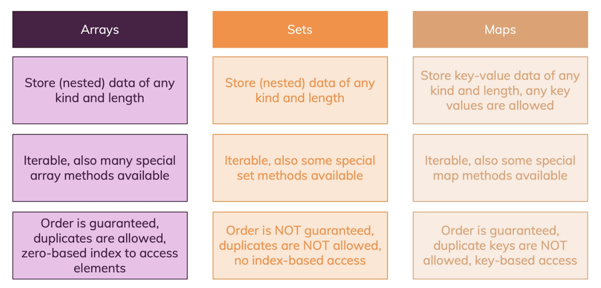
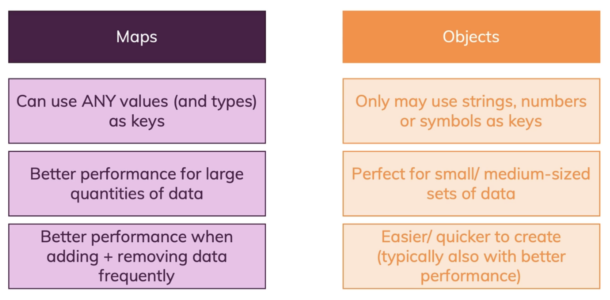

#
### 7.2. adding & removing 
增加/删除 （改变原数组）
push(), unshift(), pop(), shift()

```js
const numbers = [2, 2, 2]; 

numbers.push(6);//[2, 2, 2, 6]
numbers.unshift(1);//[1, 2, 2, 2, 6]//at the beginning

numbers.pop();//return [1, 2, 2, 2] delete last one 
numbers.shift();//return [2, 2, 2] delete first one

numbers[1] = 3;//[2, 3, 2]
numbers[6] = 6;//[2, 3, 2, empty × 3, 6]
```

[Array.prototype.splice()](https://developer.mozilla.org/en-US/docs/Web/JavaScript/Reference/Global_Objects/Array/splice)


#
### 7.3. Selecting Ranges & Creating Copies
slice(), 会改变原数组
```js
arrayName.splice(startIndexNumber, deleteCount, addItem1, addItem2, ...); 
```  

```js
const newArray = arrayName.slice(arrayIndexStart, arrayIndexEnd); 
//return a new array.
```

concat()  
Return (copy) **`a new array`** after add items at the end. 不改变原数组
```js
const newArray = arrayName.concat([newItem1, newItem2, ...]);
```

#
### 7.4. Retrieving Indexes with indexOf() & lastIndexOf()
return the index number. *not work for object. 
```js
arrayName.indexOf(itemValue); //from first one, return index-number
arrayName.lastIndexOf(itemValue); //from last one 
```


#
### 7.5. find() and findIndex()
finding stuff in object.  
`find()` dose not create a copy. 
```js
const inventory = [
  {name: 'apples', quantity: 2},
  {name: 'cherries', quantity: 5}
];
const result = inventory.find( (item,index, items) => { 
  return item.name === 'cherries'} );

const resultIndex = inventory.findIndex( (item,index, items) => { 
  return item.name === 'cherries'} );
console.log(result, resultIndex); 
// { name: 'cherries', quantity: 5 } , 1
```

#
### 7.6. includes()
查找
If cant find, return '-1'.
```js
console.log(arrayName.includes(itemValue));//return true/false
```
#
### 7.7. sort() and reverse()
排序
```js
const arrayName = [71, 22, 103, 54, 65, 86];
const tax = 0.1;

const newArray = arrayName.sort((a, b)=> {
  if (a > b){
    return 1;
  } else if (a === b){
    return 0;
  } else {
    return -1;
  }
});

console.log(newArray);
//[22, 54, 65, 71, 86, 103]
```

#
### 7.8. forEach() 
```js
const arrayName = [1, 2, 3, 4, 5, 6];
const tax = 0.1;
const newArray = [];

arrayName.forEach((element, idx, elements)=>{
  const newElement = {index: idx,  number: element + tax};
  newArray.push(newElement);
})
console.log(newArray);
//[{index: 0, number: 1.1}, {index: 1, number: 2.1}, {…}, {…}, {…}, {…}]
```
#
### 7.9. map()
循环，返回新数组，不改变原数组
```js
const arrayName = [1, 2, 3, 4, 5, 6];
const tax = 0.1;

const newArray = arrayName.map((element, idx, elements)=>{
  const newElement = {index: idx,  number: element + tax};
  return newElement;
});

console.log(newArray);
//[{index: 0, number: 1.1}, {index: 1, number: 2.1}, {…}, {…}, {…}, {…}]
```

#
### 7.10. Filtering Arrays with filter()
筛选,返回新数组，不改变原数组
```js
const arrayName = [71, 22, 103, 54, 65, 86];

const filterArray = arrayName.filter((element, index, elements) => {
  return element > 50;
})
console.log(`copy:`,filterArray);//[71, 103, 54, 65, 86]
```

#
### 7.11. reduce()
处理
```js
const arrayName = [1.1, 2.2, 3, 4, 5, 6];

const sum = arrayName.reduce((prevValue, curValue, index , Elements) => {
  return prevValue + curValue;
}, 0);
console.log(sum);//21.3x
```

#
With all these useful array methods you learned about, it's important to understand how you can combine them. Let's take **`map()`** and **`reduce()`** as an example:
```js
const originalArray = [{price: 10.99}, {price: 5.99}, {price: 29.99}];
const transformedArray = originalArray.map(obj => obj.price); // produces [10.99, 5.99, 29.99]
const sum = transformedArray.reduce((sumVal, curVal) => sumVal + curVal, 0); // => 46.97
```
Of course, you could skip the map step and just add the extraction logic to **`reduce()`**:
```js
const originalArray = [{price: 10.99}, {price: 5.99}, {price: 29.99}];
const sum = originalArray.reduce((sumVal, curVal) => sumVal + curVal.price, 0); // => 46.97
```
But let's say you have a more complex extraction logic and hence want to split this into multiple method calls. Or you have a re-usable map function which you want to be able to use in different places of your app. Then you can still write the initial example in a more concise way if you **leverage method chaining**:
```js
const originalArray = [{price: 10.99}, {price: 5.99}, {price: 29.99}];
const sum = originalArray.map(obj => obj.price)
    .reduce((sumVal, curVal) => sumVal + curVal, 0); // => 46.97
```   
We call **`.reduce()`** directly on the result of **`map()`** (which produces an array, that's why this is possible). Hence we can avoid storing the mapped array in a separate constant or variable that we might not need in any other place.

#
### 7.12. split() and join()
string to array

```js
const data = "Sydney;Canberra;Melbourne";
const array = data.split(";");
console.log(array);//["Sydney", "Canberra", "Melbourne"]

const nameFragments = ['Max','Zhang'];
const name = nameFragments.join(' ');
console.log(name);//Max Zhang
```

#
### 7.13. Spread Operator (...)

spread for copy or 
```js
const numbers = [1, 2, 3]; 
const newNumber = [...numbers];

numbers.push(4);
console.log(numbers, newNumber);
//[1, 2, 3, 4]    //[1, 2, 3]
console.log(Math.min(...numbers));//1
```

**Copy:**  
包括上面的所有复制，object的refer都是相同的。（详情看堆内存详解）  
改变原有array的object值，复制的array也会随之改变。（引申：浅拷贝，深拷贝）
```js
const name = [{age : 1},{age : 2}];
const newName = [...name];

name.push({age : 3});
console.log(name, newName);
//[{age: 1}, {age: 2}, {age: 3}]
//[{age: 1}, {age: 2}]

name[0].age = 4;
console.log(name, newName);
//[{age: 4}, {age: 2}, {age: 3}]
//[{age: 4}, {age: 2}]
```


#
### 7.14. Array Destructuring

```js
const nameFragments = ['Max','Zhang', 'male', 28];
const [firstName, LastName, ...others] = nameFragments;
console.log(firstName,LastName, others);
//Max Zhang ["male", 28]
```

#
### 7.15. maps and sets 
3 major iterable data structures.(Array, Set, Map)


???????????????????????????????????

**Map & object**


#
### 7.16. WeakSet & WeakMap


#
### 7.17. Question 小问题
*两个array变成一个object：{array1 : array2}

*array 前面的property名字变换：
```js
const array = [1, 2, 3, 4, 5, 6];
const arrayMonth = ['Jan', 'Feb', 'Mar', 'Apr', 'May'];

const mapArray = arrayMonth.map( (val)=> { 
  return { [array[idx] + `月`]: val};
});
console.log(mapArray);
// 0: {1月: "Jan"}
// 1: {2月: "Feb"}
// 2: {3月: "Mar"}
// 3: {4月: "Apr"}
// 4: {5月: "May"}
```