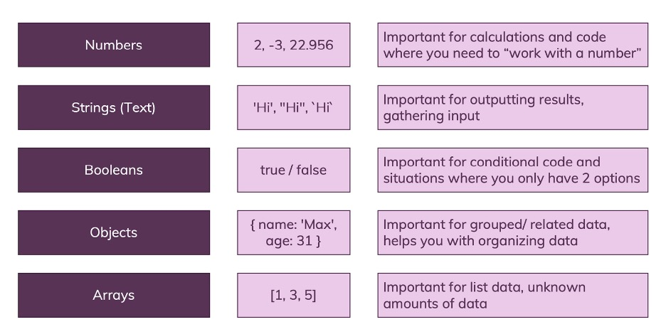

## 2. Language Basics, Base Syntax
#
### 2.1. Variables & Constants


variable: A data container where the data can be changed during program execution.

#
### 2.2. Declaring & Defining


**set up as a global value:**  
it's also quite common to use all uppercase characters there and separate words with an underscore, to make it really clear that this is a global value which you just 'hard coded' into the code.
```js
const ATTACK_VALUE = 10;
```

#
### 2.3. Operators


```js
number = number + newNumber; //same as:
number += newNumber

number = number + 1; //same as:
number++;
```
#
### 2.4. Some data types 


**String**  
Javascript template literal `(``)`. [links](https://developer.mozilla.org/en-US/docs/Web/JavaScript/Reference/Template_literals)
```js
let currentResult = "(" + defaultResult + "+ 10) * 3 / 2 -1";
let currentResult = `(${defaultResult} + 10) * 3 / 2 -1`;
```

string Escape notation. [Link](https://developer.mozilla.org/en-US/docs/Web/JavaScript/Reference/Global_Objects/String#Escape_notation)  

* css: `white-space: pre`.


#
### 2.5. Function


A function defines code which doesn't execute right away but which can be executed multiple times by calling the function.  

A function is "code on demand".  

Function parameters are Data that can be provided to the function (input) - available only inside of the function, like local variables.

**Most importantly**: A function is not "an alternative to a variable". It supports a totally different use-case. But it's also worth pointing out that variables are NOT restricted to storing numbers or strings.

**defines**
```js
function functionName(parameter1, parameter2){
  const result = parameter1 + parameter2;
  alert(`The result is ${result}`)
}
```
**call function**
```js
functionName()
```

* Build-in function
alert(), addEventListener(), prompt()

  


#
### 2.6. "Indirect" vs "Direct" Function Execution

<!-- scope and closures!!!(other section explain more) -->

It can be confusing to see that there seem to be two ways of executing a function:
```js
function add() {
  something = someNum + someOtherNum;
}
```
<span style="color: red">`add()`</span> vs <span style="color: red">`add`</span>

It's important to understand why we have these "two ways"!

**In general**, you call a function that you defined by **using its name** (e.g. `add`) and **adding parentheses** (with any parameters the function might need - or empty parentheses if no parameters are required like in the above example).

=> <span style="color: red">`add()`</span>

This is how you execute a function from your code. Whenever JavaScript encounters this statement, it goes ahead and runs the code in the function. Period!

**Sometimes however**, you **don't want to execute the function immediately**. You rather want to "tell JavaScript" that it should execute a certain function **at some point in the future** (e.g. when some event occurs).

That's when you don't directly call the function but when you instead just provide JavaScript with the name of the function.

=> <span style="color: red">`someButton.addEventListener('click', add);`</span>

This snippet would tell JavaScript: "Hey, when the button is clicked, go ahead and execute add.".

<span style="color: red">`someButton.addEventListener('click', add());`</span> would be wrong.

Why? Because JavaScript would encounter that line when it parses/ executes your script and register the event listener AND immediately execute add - because you added parentheses => That means (see above): "Please execute that function!".

Just writing add somewhere in your code would do nothing by the way:
```js
let someVar = 5;
add
alert('Do something else...');
```
Why?

Because you just throw the name of the function in there but **you don't give any other information to JavaScript**. It basically doesn't know what to do with that name ("Should I run that when a click occurs? After a certain amount of time? I don't know...") and hence JavaScript kind of ignores this statement.


#
### 2.7. return
```js
function functionName(parameter1, parameter2){
  const result = parameter1 + parameter2;
  return result;
}
```
Any code that have write after <span style="color: red">`return`</span>, won't execute.  


#
### 2.8. scope and closures

You can't use local/block-scope variables(= declared inside of functions) outside of them.

**shadowing**

What happens if you have this code?
```js
let userName = 'Max';
function greetUser(name) {
  let userName = name;
  alert(userName);
}
userName = 'Menu';
greetUser('Max');
```
This will actually show an alert that says <span style="color: red">`'Max'`</span> (NOT <span style="color: red">`'Menu'`</span>).

You might've expected that an error gets thrown because we use and declare <span style="color: red">`userName`</span> more than once - and as you learned, that is not allowed.

It indeed is **not allowed on the same level/ in the same scope**.

So this would fail:
```js
let userName = 'Max';
let userName = 'Menu';
```
Why does it work in the first code snippet though?

Because we first create a global variable <span style="color: red">`userName`</span> via
```js
let userName = 'Max';
```
But then we never re-declare that on the global level (that would not be allowed).

We only declare another variable inside of the function. But since variables in functions get their **own scope**, JavaScript does something which is called **"shadowing"**.

It **creates a new variable on a different scope** - this variables does not overwrite or remove the global variable by the way - **both co-exist**.

When referring to <span style="color: red">`userName`</span> inside of the <span style="color: red">`greetUser`</span> function we now **always refer to the local, shadowed variable**. Only **if no such local variable existed, JavaScript would fall back to the global variable**.

#
### 2.9. Converting Data Types
**change the string to number.**
```js
parseInt(10);
parseFloat(10.1);
```
**also work as**

```js
result + +userInput.value = result + parseInt(userInput.value)
```

if the number's length is more than 16, it wouldn't work. try use BigInt().

**change the number to string.**
```js
result.toString()
```

**check is it a number.**
```js
isNan(inputNumber)
```


**font setting**

```js
xxx.toUpperCase();
```

**Mix number and string**  
You saw the example with a number and a "text number" being added

<span style="color: red">`3 + '3'`</span>=> <span style="color: red">`'33'`</span>

in JavaScript.

That happens because the + operator also supports strings (for string concatenation).

It's the only arithmetic operator that supports strings though. For example, this will not work:

<span style="color: red">`'hi' - 'i'`</span>=> <span style="color: red">`NaN`</span>

<span style="color: red">`NaN`</span> is covered a little later, the core takeaway is that you can't generate a string of 'h' with the above code. Only <span style="color: red">`+`</span> supports both strings and numbers.

Thankfully, JavaScript is pretty smart and therefore is actually able to handle this code:

<span style="color: red">`3 * '3'`</span> => <span style="color: red">`9`</span>

Please note: It yields the number (!) <span style="color: red">`9`</span>, NOT a string <span style="color: red">`'9'`</span>!

Similarly, these operations also all work:

<span style="color: red">`3 - '3'`</span> => <span style="color: red">`0`</span>

<span style="color: red">`3 / '3'`</span> => <span style="color: red">`1`</span>

Just <span style="color: red">`3 + '3'` </span>yields <span style="color: red">`'33'`</span> because here JavaScript uses the "I can combine text" mode of the <span style="color: red">`+`</span> operator and generates a string instead of a number.


#
### 2.10. arrays
Section 8 will explain more. [Link](#8-arrays--iterables)  
Array: A list of data of any kind.
```js
newArray = [1, 2, 3]；
newArray.push("4")；
console.log(newArray[0]);
```

#
### 2.11. object 
Section 9 will explain more. [Link](#9-objects)  
object: grouped data, structured in key-value pairs.

```js
newObject = {
  name: 'max';
  age: 27;
}；
console.log(newObject.name);
```
#
### 2.12. undefined, null & NaN


<span style="color: red">`undefined`</span> & <span style="color: red">`null`</span> - whilst the two values are similar, they're not equal. undefined is a special type and the default value for undefined variables, null is actually of type object and never a default value of anything.

#
### 2.13. type of

`typeof [1, 2, 3]` is an **Object**  
`typeof undefined` is **undefined**  
`typeof null` is **Object**  
`typeof NaN` is **number**

#
### 2.14. import JS file with "defer" & "async"
only for external file


